# OpenCog Cognitive Architecture in cogn8n

## System Architecture Diagram

```mermaid
graph TB
    subgraph "cogn8n - Cognitive Workflow Platform"
        subgraph "OpenCog Integration Layer"
            AS[AtomSpace Node<br/>🔵 Knowledge Representation]
            RE[Reasoning Engine Node<br/>🟣 Inference & Logic]
            CA[Cognitive Agent Node<br/>🔴 Autonomous Behavior]
            PM[Pattern Miner Node<br/>🟠 Knowledge Discovery]
        end
        
        subgraph "Existing n8n Ecosystem"
            LC[LangChain Nodes<br/>🤖 AI Agents]
            API[API Connectors<br/>🔌 Data Sources]
            DB[Database Nodes<br/>💾 Storage]
            PROC[Processing Nodes<br/>⚙️ Transformation]
        end
        
        subgraph "Cognitive Workflows"
            KR[Knowledge<br/>Representation]
            INF[Inference<br/>Processing]
            LEARN[Learning &<br/>Adaptation]
            DISC[Pattern<br/>Discovery]
        end
    end
    
    %% Knowledge Flow
    AS --> KR
    RE --> INF
    CA --> LEARN
    PM --> DISC
    
    %% Integration Points
    API --> AS
    DB --> AS
    AS --> RE
    RE --> CA
    CA --> PM
    PM --> AS
    
    %% AI Enhancement
    LC --> CA
    CA --> LC
    
    %% Data Processing
    PROC --> AS
    AS --> DB
    
    style AS fill:#4A90E2,color:#fff
    style RE fill:#8E44AD,color:#fff
    style CA fill:#E74C3C,color:#fff
    style PM fill:#F39C12,color:#fff
```

## Cognitive Processing Pipeline

## Multi-Agent Cognitive System

## Knowledge Representation Structure

## Reasoning Engine Types

